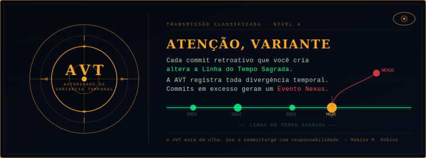

<div align="center">


# CommitForge

### Commits retroativos no Git — direto do seu terminal

<p>
  
  
  
  
  
  
  
</p>

<p>
  
  
  
  
</p>

---

**[⬇ Baixar CommitForge](#-instalação)** &nbsp;·&nbsp;
**[📖 Documentação](#-documentação-da-cli)** &nbsp;·&nbsp;
**[🚀 Início Rápido](#-início-rápido)** &nbsp;·&nbsp;
**[🌐 Demo Online](https://commitforge.vercel.app)**

</div>

---

## 📋 Índice

- [O que é o CommitForge?](#-o-que-é-o-commitforge)
- [Para que serve?](#-para-que-serve)
- [Funcionalidades](#-funcionalidades)
- [Instalação](#-instalação)
- [Início Rápido](#-início-rápido)
- [Modos de Commit](#-modos-de-commit)
- [Documentação da CLI](#-documentação-da-cli)
- [Interface Web](#-interface-web)
- [API REST](#-api-rest)
- [Docker](#-docker)
- [Estrutura do Projeto](#-estrutura-do-projeto)
- [Tecnologias Utilizadas](#-tecnologias-utilizadas)
- [Scripts Disponíveis](#-scripts-disponíveis)
- [Exemplos Práticos](#-exemplos-práticos)
- [Configuração](#-configuração)
- [Solução de Problemas](#-solução-de-problemas)

---

## 🔥 O que é o CommitForge?

**CommitForge** é uma ferramenta completa para criar **commits retroativos no Git** com datas personalizadas. Permite registrar o histórico real de desenvolvimento de projetos antigos, preencher períodos no gráfico de contribuições do GitHub ou organizar o histórico de um repositório com datas precisas.

---

> ### ⚠️ A AVT está de olho
>
> 
>
> Cada commit retroativo criado pelo CommitForge **altera a Linha do Tempo Sagrada**.
> A **AVT (Autoridade de Variância Temporal)** registra toda divergência temporal — branches
> fora do padrão geram um **Evento Nexus** e equipes de poda podem ser despachadas.
>
> Use o CommitForge com responsabilidade: a ferramenta existe para **documentar trabalho real**,
> não para falsificar histórico. A AVT (e o GitHub) aprecia a honestidade.
>
> *Visualize sua linha do tempo no painel AVT:* **`http://localhost:5001/timeline`**

---

O projeto é composto por três camadas:

| Camada | Tecnologia | Descrição |
|--------|-----------|-----------|
| **CLI Standalone** | Python + Click + Rich | `commitforge` — CLI instalada globalmente |
| **Backend + Web UI** | Flask + HTML/CSS/JS | Servidor local com interface gráfica |
| **Landing Page + Docs** | Next.js 15 + Tailwind | Site público com documentação completa |

---

## 🎯 Para que serve?

- **Projetos legados** — desenvolveu um projeto em 2018 sem usar Git? Recrie o histórico com as datas originais.
- **Portfólio técnico** — organize o gráfico de contribuições do GitHub para refletir sua atividade real ao longo dos anos.
- **Migração de VCS** — migrando de SVN, Mercurial ou outro sistema? Recrie o histórico com as datas originais.
- **Histórico semântico** — o modo `projeto` agrupa automaticamente os arquivos em 17 categorias (configuração, estilos, componentes, backend, CLI...) criando commits com mensagens padronizadas no estilo Conventional Commits.
- **Demonstrações e ensino** — crie repositórios de exemplo com histórico realista.

---

## ✨ Funcionalidades

- ✅ **Commits com datas retroativas** via `GIT_AUTHOR_DATE` e `GIT_COMMITTER_DATE`
- ✅ **17 grupos semânticos** — agrupamento automático de arquivos por tipo
- ✅ **Dois modos**: `projeto` (arquivos reais) e `arquivo` (log de entradas)
- ✅ **Múltiplas plataformas**: GitHub, GitLab, Bitbucket, Gitea, Azure DevOps
- ✅ **Interface Web** com progresso em tempo real
- ✅ **CLI interativa** com prompts guiados (`--interativo`)
- ✅ **Horários aleatórios realistas** (`--aleatorio`)
- ✅ **Pular fins de semana** (`--pular-fins-de-semana`)
- ✅ **Branch órfão** para histórico limpo sem conflitos
- ✅ **API REST** com 15 endpoints documentados
- ✅ **Docker ready** — sem dependências locais
- ✅ **Histórico local** de execuções em `.forge_history.json`
- ✅ **Persistência de jobs** em `jobs_history.json`
- ✅ **CORS configurável** no servidor Flask
- ✅ **Validação de token** GitHub via API

---

## ⬇ Instalação

Escolha o método que melhor se adapta ao seu ambiente:

### Método 1 — curl (recomendado para macOS/Linux)

```bash
curl -fsSL https://raw.githubusercontent.com/estevam5s/commitforge/main/cli-commit/install.sh | bash
```

O script instala automaticamente:
- Verifica Python 3.8+ e git
- Cria ambiente virtual em `~/.commitforge/venv`
- Instala todas as dependências Python
- Cria os comandos `commitforge` e `forge` em `~/.local/bin`
- Atualiza o PATH no `.zshrc` ou `.bashrc`

Após instalar, recarregue o shell:

```bash
source ~/.zshrc   # ou ~/.bashrc
commitforge --version
```

---

### Método 2 — Docker

```bash
docker pull ghcr.io/estevam5s/commitforge:latest

docker run --rm \
  -e GITHUB_TOKEN=ghp_seu_token_aqui \
  ghcr.io/estevam5s/commitforge:latest \
  commitforge commit \
    --repo https://github.com/user/repo.git \
    --year 2020 \
    --modo projeto
```

---

### Método 3 — macOS (Homebrew)

```bash
brew tap estevam5s/commitforge
brew install commitforge

commitforge --version
```

---

### Método 4 — Linux (apt / dnf / AUR)

```bash
# Debian / Ubuntu
curl -fsSL https://apt.commitforge.dev/gpg | sudo apt-key add -
echo "deb https://apt.commitforge.dev stable main" | \
  sudo tee /etc/apt/sources.list.d/commitforge.list
sudo apt update && sudo apt install commitforge

# Fedora / RHEL
sudo dnf install commitforge

# Arch Linux (AUR)
yay -S commitforge
```

---

### Método 5 — pip (universal)

```bash
pip install commitforge

# Com ambiente virtual (recomendado no macOS com Python gerenciado)
python -m venv venv && source venv/bin/activate
pip install -r cli-commit/requirements.txt
```

---

### Método 6 — Clonar o repositório

```bash
git clone https://github.com/estevam5s/commitforge.git
cd commitforge/cli-commit

python -m venv venv
source venv/bin/activate        # Windows: venv\Scripts\activate
pip install -r requirements.txt

commitforge --version       # forge, version 1.0.0
```

---

## 🚀 Início Rápido

```bash
# 1. Validar o token do GitHub
commitforge validar-token --token ghp_seu_token

# 2. Ver como os arquivos serão agrupados
commitforge grupos --repo https://github.com/user/repo.git

# 3. Criar commits com datas de 2019
commitforge commit \
  --repo https://github.com/user/repo.git \
  --year 2019 \
  --modo projeto \
  --token ghp_seu_token

# 4. Ou usar o modo interativo (sem precisar lembrar flags)
commitforge commit --interativo
```

---

## 🔀 Modos de Commit

### Modo Projeto (`--modo projeto`) — recomendado

Commita os **arquivos reais** do repositório agrupados em 17 categorias semânticas. Usa um branch órfão para histórico limpo.

```
[configuração]        package.json, tsconfig.json, .gitignore...
[assets]              public/*, static/*, assets/*
[estilos]             *.css, *.scss, styles/*
[layout]              app/layout*, layouts/*
[utilitários]         lib/*, utils/*, hooks/*
[componentes-base]    components/ui/button*, input*...
[componentes-nav]     navigation*, menu*, tabs*...
[componentes-overlay] dialog*, drawer*, tooltip*...
[componentes-dados]   table*, card*, chart*...
[página-principal]    app/page*, index.html
[páginas]             app/**/page*, pages/*
[backend]             app.py, server.py, api/*
[cli]                 bin/commitforge, bin/forge
[templates]           templates/*, *.html
[testes]              test_*, tests/*, *.spec.*
[readme]              README*, *.md
[outros]              (arquivos restantes)
```

```bash
commitforge commit \
  --repo https://github.com/user/portfolio.git \
  --year 2019 \
  --modo projeto \
  --aleatorio \
  --token ghp_xxx
```

### Modo Arquivo (`--modo arquivo`)

Cria commits modificando um arquivo de log. Ideal para controle exato da quantidade de commits por dia.

```bash
commitforge commit \
  --repo https://github.com/user/repo.git \
  --year 2020 \
  --modo arquivo \
  --commits-por-dia 3 \
  --pular-fins-de-semana \
  --token ghp_xxx
```

---

## 📟 Documentação da CLI

### Todos os comandos

```bash
commitforge commit         # Criar commits retroativos
commitforge grupos         # Listar grupos de arquivos do repo
commitforge preview        # Prévia de commits sem executar
commitforge validar-token  # Validar token do GitHub
commitforge historico      # Ver histórico de execuções
commitforge info           # Informações do sistema e configuração
commitforge cancelar       # Cancelar job (modo servidor)
commitforge servidor       # Iniciar interface web (porta 5000)
```

### Flags do comando `commit`

| Flag | Tipo | Padrão | Descrição |
|------|------|--------|-----------|
| `--repo, -r` | string | — | URL HTTPS ou SSH do repositório |
| `--year, -y` | int | — | Ano completo (ex: 2019) |
| `--start-date` | YYYY-MM-DD | — | Data de início do período |
| `--end-date` | YYYY-MM-DD | — | Data de fim do período |
| `--dias, -d` | int | 30 | Últimos N dias a partir de hoje |
| `--modo, -M` | projeto\|arquivo | projeto | Modo de criação de commits |
| `--branch` | string | historico-{year} | Nome do branch a criar |
| `--token, -t` | string | $GITHUB_TOKEN | Token de acesso pessoal |
| `--usuario` | string | — | Nome do autor dos commits |
| `--email` | string | — | E-mail do autor dos commits |
| `--commits-por-dia` | int | 1 | Commits por dia (modo arquivo) |
| `--mensagem, -m` | string | Commit retroativo: {date} | Template da mensagem |
| `--arquivo, -f` | string | data.txt | Arquivo de log (modo arquivo) |
| `--aleatorio` | flag | false | Horários aleatórios realistas |
| `--pular-fins-de-semana` | flag | false | Pular sábado e domingo |
| `--sem-push` | flag | false | Não enviar ao repositório remoto |
| `--interativo` | flag | false | Modo interativo com prompts |

### Obter ajuda

```bash
commitforge -h
commitforge commit -h
commitforge preview --help
```

---

## 🖥 Interface Web

```bash
# Iniciar via CLI
commitforge servidor --porta 5000

# Ou direto
cd cli-commit && python app.py

# Com variáveis de ambiente
PORT=8080 DEBUG=false python app.py
```

Acesse **http://localhost:5000** no navegador.

**Funcionalidades da interface:**
- Formulário com todos os parâmetros
- Seletor visual de modo (projeto / arquivo)
- Progresso em tempo real com barra animada
- Log de execução linha a linha
- Histórico de jobs anteriores
- Cancelamento de jobs em andamento

---

## 🔌 API REST

O servidor Flask expõe 15 endpoints:

| Método | Endpoint | Descrição |
|--------|----------|-----------|
| `GET` | `/api/health` | Health check e uptime |
| `GET` | `/api/stats` | Estatísticas gerais |
| `GET` | `/api/config` | Configuração e versão |
| `GET` | `/api/groups` | Lista os 17 grupos semânticos |
| `POST` | `/api/start-job` | Iniciar novo job |
| `GET` | `/api/job-status/:id` | Status de um job |
| `POST` | `/api/cancel-job/:id` | Cancelar job em andamento |
| `GET` | `/api/jobs` | Listar todos os jobs da sessão |
| `GET` | `/api/logs/:id` | Log de execução do job |
| `POST` | `/api/clean-job/:id` | Limpar arquivos temporários |
| `DELETE` | `/api/delete-job/:id` | Remover job da memória |
| `GET` | `/api/history` | Histórico persistido em disco |
| `POST` | `/api/preview` | Prévia de commits sem executar |
| `POST` | `/api/validate-token` | Validar token do GitHub |

**Exemplo — iniciar um job:**

```bash
curl -X POST http://localhost:5000/api/start-job \
  -H "Content-Type: application/json" \
  -d '{
    "repo_url": "https://github.com/user/repo.git",
    "github_token": "ghp_seu_token",
    "year": 2020,
    "commit_mode": "projeto",
    "random_times": true
  }'
```

```json
{ "status": "success", "job_id": "job_a3f8c12e", "commit_mode": "projeto" }
```

**Exemplo — monitorar progresso:**

```bash
curl http://localhost:5000/api/job-status/job_a3f8c12e
```

```json
{
  "job": {
    "status": "running",
    "progress": 65,
    "commits_made": 8,
    "total_commits": 13,
    "branch": "historico-2020"
  }
}
```

---

## 🐳 Docker

### docker-compose.yml

```yaml
version: '3.8'
services:
  commitforge:
    image: ghcr.io/estevam5s/commitforge:latest
    ports:
      - "5000:5000"
    environment:
      - GITHUB_TOKEN=${GITHUB_TOKEN}
      - PORT=5000
      - DEBUG=false
    volumes:
      - ./repos:/app/repos
      - ./jobs_history.json:/app/jobs_history.json
```

```bash
# Build local
docker build -t commitforge ./cli-commit

# Commit retroativo
docker run --rm -e GITHUB_TOKEN=ghp_xxx commitforge \
  commitforge commit --repo URL --year 2019 --modo projeto

# Servidor web
docker run -d -p 5000:5000 -e GITHUB_TOKEN=ghp_xxx \
  --name commitforge-server commitforge python app.py

# docker-compose
docker-compose up -d
docker-compose logs -f
```

---

## 🗂 Estrutura do Projeto

```
commitforge/
│
├── app/                         # Next.js — Landing Page
│   ├── page.tsx                 # Página principal com instalação + CLI ref
│   ├── docs/
│   │   └── page.tsx             # Documentação interativa (10 seções)
│   └── layout.tsx
│
├── cli-commit/                  # Core do CommitForge
│   ├── forge.py                 # Motor da CLI (executado pelo wrapper)
│   ├── app.py                   # Servidor Flask + 15 endpoints REST
│   ├── cli.py                   # CLI com dependência do servidor Flask
│   ├── install.sh               # Script de instalação via curl
│   ├── requirements.txt         # Dependências Python
│   ├── Dockerfile               # Container Docker
│   ├── templates/
│   │   └── index.html           # Interface Web (UI)
│   └── static/
│       └── js/main.js           # Lógica frontend da interface web
│
├── site-guia/                   # Site guia passo a passo (HTML puro)
│   ├── index.html
│   ├── css/styles.css
│   └── js/main.js
│
├── site-lua/                    # Exemplo: site commitado em 2010
│   ├── index.html
│   ├── css/
│   └── js/
│
├── public/
│   └── sistema.png              # Logo do sistema
│
├── components/                  # Componentes React (shadcn/ui)
├── package.json                 # Dependências Node.js
└── README.md
```

---

## 🛠 Tecnologias Utilizadas

### Backend — CLI e API

| Tecnologia | Versão | Uso |
|-----------|--------|-----|
| **Python** | 3.8+ | Linguagem base da CLI e servidor |
| **Flask** | 2.3.3 | Servidor web e API REST |
| **GitPython** | 3.1.40 | Operações Git programáticas |
| **Click** | 8.1.7 | Framework da CLI |
| **Rich** | 13.7.0 | Terminal UI (tabelas, progresso, cores) |
| **Requests** | 2.31.0 | Chamadas à API GitHub |
| **python-dotenv** | 1.0.0 | Variáveis de ambiente via `.env` |
| **Gunicorn** | 21.2.0 | Servidor WSGI para produção |

### Frontend — Landing Page e Docs

| Tecnologia | Versão | Uso |
|-----------|--------|-----|
| **Next.js** | 15.2.6 | Framework React com SSR/SSG |
| **React** | 19 | Biblioteca de interface |
| **TypeScript** | 5.0 | Tipagem estática |
| **Tailwind CSS** | 4.1.9 | Estilização utilitária |
| **lucide-react** | 0.454.0 | Ícones |
| **shadcn/ui** | — | Componentes de UI (Radix-based) |
| **Vercel Analytics** | 1.3.1 | Métricas de uso |

### Infraestrutura

| Tecnologia | Uso |
|-----------|-----|
| **Docker** | Containerização da CLI e servidor |
| **Vercel** | Deploy automático da landing page |
| **Git** | Controle de versão + backdating de datas |

---

## 📜 Scripts Disponíveis

### Next.js — landing page

```bash
npm run dev       # Servidor de desenvolvimento (localhost:3000)
npm run build     # Build de produção
npm run start     # Iniciar build de produção
npm run lint      # Verificar código com ESLint
```

### Python — CLI e servidor

```bash
# Instalar dependências
pip install -r cli-commit/requirements.txt

# CLI standalone
commitforge --help
commitforge info
commitforge commit --interativo

# Servidor Flask
python cli-commit/app.py
PORT=8080 python cli-commit/app.py

# Verificar sintaxe
python -m py_compile ~/.commitforge/forge.py
python -m py_compile cli-commit/app.py
```

### Docker

```bash
docker build -t commitforge ./cli-commit
docker run --rm -e GITHUB_TOKEN=ghp_xxx commitforge commitforge --help
docker-compose up -d
docker-compose logs -f
docker-compose down
```

### install.sh

```bash
# Instalar via curl
curl -fsSL https://raw.githubusercontent.com/estevam5s/commitforge/main/cli-commit/install.sh | bash

# Desinstalar manualmente
rm -rf ~/.commitforge
rm ~/.local/bin/commitforge ~/.local/bin/forge
```

---

## 💡 Exemplos Práticos

### Exemplo 1 — Site de portfólio antigo

```bash
# Ver agrupamento
commitforge grupos --repo https://github.com/user/portfolio.git

# Commitar com datas de 2019
commitforge commit \
  --repo https://github.com/user/portfolio.git \
  --year 2019 \
  --modo projeto \
  --aleatorio \
  --token ghp_seu_token
```

### Exemplo 2 — Preencher gráfico de contribuições

```bash
# Prévia antes de executar
commitforge preview \
  --year 2022 \
  --commits-por-dia 2 \
  --pular-fins-de-semana
# → Total de commits: 522

# Executar
commitforge commit \
  --repo https://github.com/user/contrib.git \
  --year 2022 \
  --modo arquivo \
  --commits-por-dia 2 \
  --pular-fins-de-semana \
  --aleatorio \
  --token ghp_xxx
```

### Exemplo 3 — Intervalo específico

```bash
commitforge commit \
  --repo https://github.com/user/projeto.git \
  --start-date 2021-06-01 \
  --end-date 2021-12-31 \
  --modo projeto \
  --branch desenvolvimento-2021 \
  --token ghp_xxx
```

### Exemplo 4 — Via API REST (CI/CD)

```bash
# Health check
curl http://localhost:5000/api/health

# Iniciar job
curl -X POST http://localhost:5000/api/start-job \
  -H "Content-Type: application/json" \
  -d '{"repo_url":"URL","github_token":"ghp_xxx","year":2020,"commit_mode":"projeto"}'

# Monitorar
curl http://localhost:5000/api/job-status/job_a3f8c12e
```

---

## 🔧 Configuração

Crie `cli-commit/.env`:

```env
GITHUB_TOKEN=ghp_seu_token_aqui
PORT=5000
DEBUG=false
SECRET_KEY=sua_chave_secreta
MAX_COMMITS=5000
CORS_ORIGIN=http://localhost:3000
JOBS_PERSIST_FILE=jobs_history.json
```

### Gerar Token do GitHub

1. Acesse **github.com/settings/tokens/new**
2. Escopos necessários: `repo`, `workflow`
3. Clique em **Generate token**
4. Adicione ao `.env` ou use `--token ghp_xxx`

```bash
# Validar token
commitforge validar-token --token ghp_seu_token
# ✓ Token válido! Usuário: seu-usuario
```

---

## 🐛 Solução de Problemas

| Erro | Causa | Solução |
|------|-------|---------|
| `Token inválido ou expirado` | Token revogado ou com escopo errado | Gerar novo em `github.com/settings/tokens` com escopo `repo` |
| `Push falhou: remote rejected` | Sem permissão de escrita | Verificar escopos do token |
| `Nenhum arquivo encontrado` | Repositório sem arquivos rastreados | Fazer um commit inicial no repositório antes |
| `externally-managed-environment` | Python gerenciado pelo sistema (macOS) | Usar `python -m venv venv && source venv/bin/activate` |
| `403 API rate limit exceeded` | Muitas requisições sem token | Usar token de acesso pessoal (PAT) |

---

## 👥 Contributors

<table>
  <tr>
    <td align="center">
      <a href="https://github.com/estevam5s">
        <br/>
        <sub><b>@estevam5s</b></sub>
      </a><br/>
      <sub>Creator & Maintainer</sub>
    </td>
  </tr>
</table>

---

## 📄 Licença

MIT License — use livremente em projetos pessoais e comerciais.

---

<div align="center">

**Construído para devs, por devs.**

[⬆ Voltar ao topo](#commitforge)

</div>
